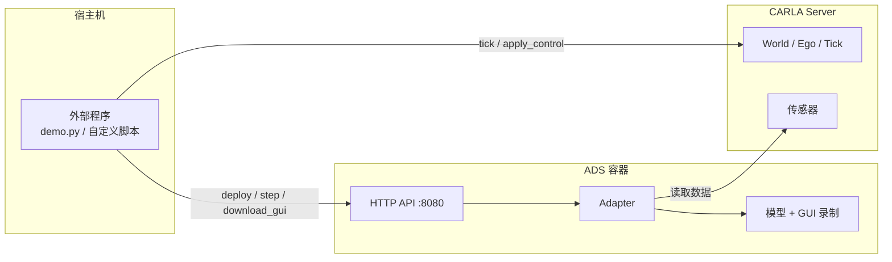
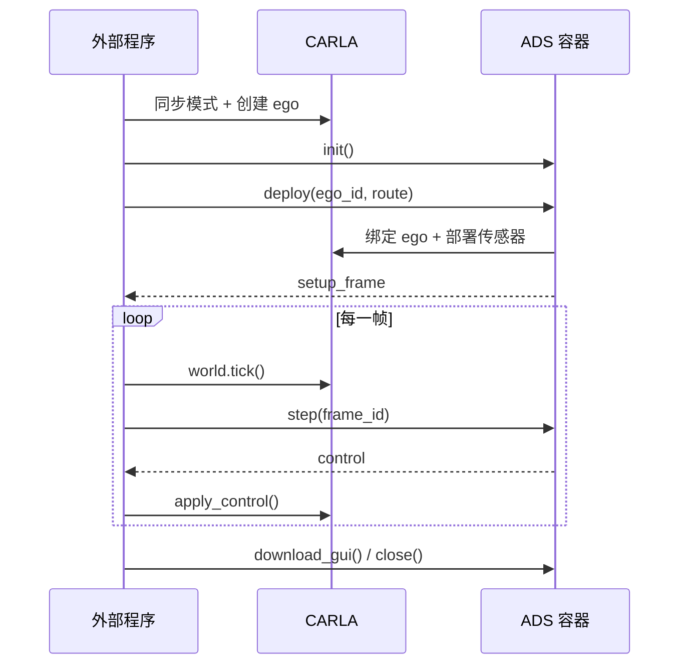

<div align="center">

# UniCarlaADS

**基于 Docker 的统一自动驾驶系统 CARLA 运行框架**


</div>

---

> [!NOTE]
> 本项目主要由 AI 辅助（vibe coding）开发，使用前请结合自身场景评估/修改/改进。

---

## 简介

UniCarlaADS 将不同自动驾驶系统（ADS）统一封装进 Docker 容器，通过 HTTP 接口对外提供服务。

## 架构



## 目前支持的ADS

| ADS | CARLA | ego 车辆 | 说明 |
| --- | --- | --- | --- |
| InterFuser | 0.9.10.1 | `vehicle.lincoln.mkz2017` | 镜像内使用 `agents09101`，Python API 取自官方 CARLA 镜像 |
| LEAD | 0.9.15 | `vehicle.lincoln.mkz_2020` | 复用上游 Leaderboard / ScenarioRunner / seed0 检查点 |
| Autoware | 0.9.16 | `vehicle.tesla.model3`（`role_name=autoware_v1`） | 基于 autoware_carla_launch 的 ROS 2 全栈，只支持 Town01 |

## 快速开始

```bash
# 0. 拉取源码与子模块（InterFuser、LEAD 已固定到上游 commit）
git clone --recurse-submodules https://github.com/yagol2020/UniCarlaADS.git
cd UniCarlaADS
# 已 clone 过则执行
git submodule update --init --recursive

# 1. 下载模型权重（权重不在 git 仓库中）
./scripts/download_interfuser_weights.sh   # InterFuser
./scripts/download_lead_checkpoint.sh      # LEAD
./scripts/download_autoware_assets.sh      # Autoware（Town01 地图 + 模型，数 GB）

# 2. 构建 ADS 镜像
./scripts/build_interfuser.sh        # InterFuser
./scripts/build_lead.sh              # LEAD（首次需下载 PyTorch 2.8 CUDA 12.8 基础镜像）
./scripts/build_autoware.sh          # Autoware（首次需编译 Rust bridge，耗时较长）
# 网络受限时可选复用已有缓存：
#   UNICARLA_CARGO_CACHE=/path/to/rust \
#   UNICARLA_CARLA_PREBUILD=/path/to/carla-prebuild \
#   ./scripts/build_autoware.sh
# 可选：基于上面镜像构建 gcov 插桩的覆盖率镜像 unicarlaads-autoware:coverage
#   ./scripts/build_autoware_coverage.sh

# 3. 启动对应版本的 CARLA 服务
./scripts/start_carla_0910.sh        # InterFuser
./scripts/start_carla_0915.sh        # LEAD
./scripts/start_carla_0916.sh        # Autoware

# 4. 在宿主机运行示例
python3.8 demo.py                    # InterFuser
python3.8 demo_lead.py               # LEAD
python3 demo_autoware.py             # Autoware（需要 carla==0.9.16）
```

宿主机需要 Docker、NVIDIA Container Toolkit，以及对应版本的 CARLA Python API：

```bash
# InterFuser 使用仓库内 carla_package/ 下的 0.9.10 egg（demo.py 已自动加载）
# LEAD 在 Python 3.7 - 3.10 环境安装
python3.8 -m pip install carla==0.9.15
# Autoware 在 Python 3.10 - 3.12 环境安装
python3 -m pip install carla==0.9.16
```

> [!IMPORTANT]
> InterFuser 权重与 LEAD 检查点都不在 git 仓库中，必须先用上面的脚本下载。
> InterFuser 权重默认从本仓库的
> [GitHub Release](https://github.com/yagol2020/UniCarlaADS/releases/tag/v0.1) 下载，
> 也可用 `INTERFUSER_WEIGHTS_URL` 指向其他镜像。

## 运行流程



### 接口一览

| 方法 | 接口 | 说明 |
| --- | --- | --- |
| `init()` | `POST /initialize` | 启动 ADS 容器并初始化模型 |
| `deploy(ego_actor_id, route)` | `POST /deploy` | 连接 CARLA、绑定 ego、部署传感器 |
| `step(frame_id)` | `POST /step` | 返回该 frame 对应的控制量 |
| `status()` | `GET /status` | 查询 ADS 当前状态 |
| `download_gui()` | `POST /download_gui` | 将 GUI 视频导出到宿主机 `video_download/` |
| `download_coverage()` | `POST /download_coverage`（覆盖率端口） | 停止 Autoware 触发 gcov 落盘，导出覆盖率归档到 `coverage_download/` |
| `close()` | `POST /close` | 清理传感器与模型，停止容器 |

### 运行示例

请参考`demo.py`文件

## ADS 说明

### InterFuser

- `deploy()` 内部调用 InterFuser 原生传感器包装器，部署阶段产生 **1 个 tick**，
  返回的 `setup_frame` 即该帧。
- `download_gui()` 将仿真期间保存在容器内存中的 GUI 帧编码为 MP4，
  可用 `output_dir`、`filename`、`fps` 指定输出位置、文件名和帧率。

### LEAD

- world 需为同步模式且 `fixed_delta_seconds=0.05`，ego 的 `role_name` 必须为 `hero`。
- `deploy()` 使用 LEAD 原生包装器预热传感器，产生 **10 个 tick**，`setup_frame`
  为预热后的帧。
- GUI 视频为 LEAD 自带的评估录制（演示视角与模型输入拼接的 grid 视频）。

### Autoware

- world 需为同步模式且 `fixed_delta_seconds=0.05`，ego 必须是 `vehicle.tesla.model3`
  且 `role_name=autoware_v1`，地图必须是 `Town01`。
- 默认开启 `no_rendering_mode`（demo 可用 `--render` 关闭），只运行
  GNSS/IMU/LiDAR；交通灯相机与录制相机也会跳过，因为无渲染模式相机出不了图。
  没有 NVIDIA Vulkan 时这同时避免软件渲染拖慢其他传感器。
- 红绿灯识别默认启用（`use_traffic_light_recognition:=true`）。识别依赖
  `traffic_light` 相机，请用 `--render` 运行；无渲染模式下没有图像，仿真中会按
  “未收到信号灯”处理直接通过路口。可用 `UNICARLA_AUTOWARE_TRAFFIC_LIGHT=0`
  环境变量关闭识别。
- 桥接方式可选 `--bridge ros2dds`（默认，zenoh-bridge-ros2dds 转 CycloneDDS）
  或 `--bridge rmw-zenoh`（Autoware 用 rmw_zenoh 直连 bridge，少一跳，图像流更稳）。
- Autoware 是 ROS 2 全栈，`deploy()` 会部署 GNSS/IMU/LiDAR（启用渲染时还有交通灯
  相机与录制用第三人称相机）、设置初始位姿与路线、请求进入自动驾驶，并内部 tick
  预热，`setup_frame` 为预热后的帧。
- 控制回路：Autoware 输出 `actuation_cmd`，容器内 worker 换算为 `VehicleControl`
  后由 `step()` 返回，宿主调用 `apply_control()` 执行。
  `autoware_overlay/` 中的 Rust 补丁让 zenoh bridge 不再自行 tick 和写控制。
- 地图坐标与 CARLA 坐标差一个 y 轴符号，适配器会自动转换；
  如遇地图类型不同，可用 `UNICARLA_AUTOWARE_Y_FLIP=0` 关闭。
- `assets-dir` 需要包含完整的 `autoware_data/` 与 `carla_map/Town01/`，
  可用 `--assets-dir` 指向已有目录复用（例如其他机器下载过的数据）。
- `download_gui()` 仅在使用 `--render` 运行时可用：worker 在仿真期间缓存录制相机
  的第三人称画面，调用时编码为 MP4，`output_dir`、`filename`、`fps` 与 InterFuser
  一致；`no_rendering_mode` 下调用会返回错误。
- 代码覆盖率：`scripts/build_autoware_coverage.sh` 会用 gcov 插桩重编 Autoware
  感知/预测/规划（含决策）模块，默认 = 两个源码仓库 `planning/` 与 `perception/`
  下全部约 133 个包（可用 `UNICARLA_COVERAGE_PACKAGES` 缩小范围），产出
  `unicarlaads-autoware:coverage`（约 96GB，构建约 40 分钟）；`demo_autoware.py --coverage` 使用该
  镜像并在视频下载后调用 `download_coverage()`，归档（tar.gz）包含 `coverage.info`、
  `summary.txt` 与 `html/`。分支数据已剔除编译器插入的异常路径分支，只保留源码里的
  真实条件分支。覆盖率服务监听 `--coverage-port`（默认 8081，仅 `--coverage` 时启用），
  保存前会 SIGINT 停止 Autoware，因为 libgcov 只在进程退出时写 `.gcda`。

> [!TIP]
> `start_carla_0910.sh` 使用 `DISPLAY=`、`SDL_VIDEODRIVER=offscreen` 与 `-opengl`，
> 可在无头服务器运行。启动时出现 `xdg-user-dir: not found` 是官方镜像的提示，
> 不影响 CARLA 服务。

## 目录结构

```
UniCarlaADS/
├── demo.py / demo_lead.py / demo_autoware.py  # 宿主侧示例
├── service.py                 # 宿主侧 ADS 调用入口
├── docker/                    # InterFuser / LEAD / Autoware 的 Dockerfile
├── scripts/                   # 构建、启动与权重下载脚本
├── unicarla_ads/worker/       # 容器内 HTTP 服务与适配器
├── autoware_overlay/          # 需要编译的上游文件修改（Dockerfile 动态替换）
├── InterFuser/  lead/         # 上游 ADS 源码（submodule，固定上游 commit，不修改）
├── autoware_carla_launch/     # Autoware 启动与桥接源码（submodule，不修改）
├── video_download/            # GUI 视频输出目录
├── LICENSE                    # 本项目 MIT 许可
└── THIRD_PARTY_NOTICES.md     # 第三方许可声明
```

> [!NOTE]
> `InterFuser/`、`lead/` 与 `autoware_carla_launch/` 都是 git submodule，固定在上游
> commit，运行时的差异都通过 `unicarla_ads/worker/` 适配器或 `autoware_overlay/`
> 在构建/运行时动态替换，子模块内容保持与上游一致。

## 许可证与致谢

本项目采用 [MIT License](LICENSE)。第三方组件（InterFuser、LEAD、Autoware、CARLA 等）的许可与版权归属
见 [THIRD_PARTY_NOTICES.md](THIRD_PARTY_NOTICES.md)。

## 引用

若本项目对你的研究有帮助，请引用所使用 ADS 的论文：

```bibtex
@inproceedings{shao2022interfuser,
  title     = {Safety-Enhanced Autonomous Driving Using Interpretable Sensor Fusion Transformer},
  author    = {Shao, Hao and Wang, Letian and Chen, RuoBing and Li, Hongsheng and Liu, Yu},
  booktitle = {Conference on Robot Learning (CoRL)},
  year      = {2022}
}

@inproceedings{nguyen2026lead,
  title     = {LEAD: Minimizing Learner-Expert Asymmetry in End-to-End Driving},
  author    = {Nguyen, Long and Fauth, Micha and Jaeger, Bernhard and Dauner, Daniel and
               Igl, Maximilian and Geiger, Andreas and Chitta, Kashyap},
  booktitle = {Conference on Computer Vision and Pattern Recognition (CVPR)},
  year      = {2026}
}
```


