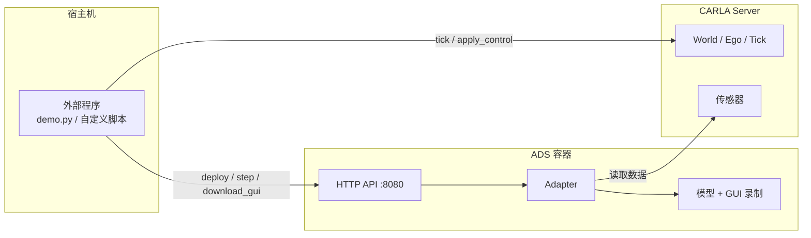
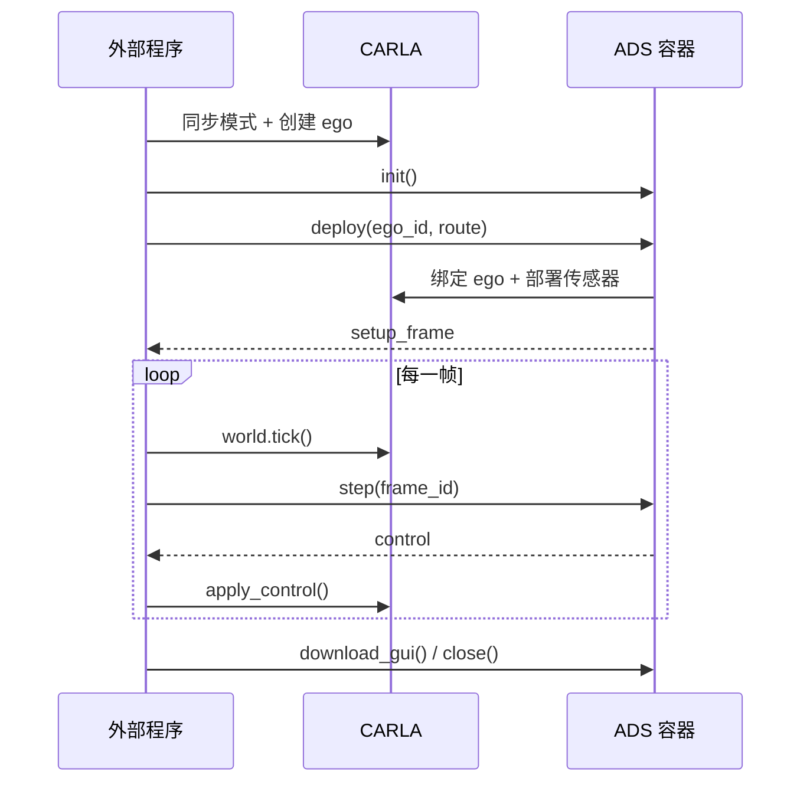

<div align="center">

# UniCarlaADS

**基于 Docker 的统一自动驾驶系统 CARLA 运行框架**


</div>

---

## 简介

UniCarlaADS 将不同自动驾驶系统（ADS）统一封装进 Docker 容器，通过 HTTP 接口对外提供
`init / deploy / step / download_gui / close` 服务。

核心原则：**仿真场景由外部程序推进**。外部程序负责创建 ego、设置同步模式、调用
`world.tick()` 并应用控制信号；ADS 容器只负责加载模型、部署传感器，并根据外部产生的
frame 返回控制量。

## 架构



## 支持矩阵

| ADS | CARLA | ego 车辆 | 说明 |
| --- | --- | --- | --- |
| InterFuser | 0.9.10.1 | `vehicle.lincoln.mkz2017` | 镜像内使用 `agents09101`，Python API 取自官方 CARLA 镜像 |
| LEAD | 0.9.15 | `vehicle.lincoln.mkz_2020` | 复用上游 Leaderboard / ScenarioRunner / seed0 检查点，不修改 `lead/` 源码 |

## 快速开始

```bash
# 0. 拉取源码与子模块（InterFuser、LEAD 已固定到上游 commit）
git clone --recurse-submodules https://github.com/yagol2020/UniCarlaADS.git
cd UniCarlaADS
# 已 clone 过则执行
git submodule update --init --recursive

# 1. 下载模型权重（权重不在 git 仓库中）
./scripts/download_interfuser_weights.sh   # InterFuser
./scripts/download_lead_checkpoint.sh      # LEAD

# 2. 构建 ADS 镜像
./scripts/build_interfuser.sh        # InterFuser
./scripts/build_lead.sh              # LEAD（首次需下载 PyTorch 2.8 CUDA 12.8 基础镜像）

# 3. 启动对应版本的 CARLA 服务
./scripts/start_carla_0910.sh        # InterFuser
./scripts/start_carla_0915.sh        # LEAD

# 4. 在宿主机运行示例
python3.8 demo.py                    # InterFuser
python3.8 demo_lead.py               # LEAD
```

宿主机需要 Docker、NVIDIA Container Toolkit，以及对应版本的 CARLA Python API：

```bash
# InterFuser 使用仓库内 carla_package/ 下的 0.9.10 egg（demo.py 已自动加载）
# LEAD 在 Python 3.7 - 3.10 环境安装
python3.8 -m pip install carla==0.9.15
```

> [!IMPORTANT]
> InterFuser 权重与 LEAD 检查点都不在 git 仓库中，必须先用上面的脚本下载。
> InterFuser 权重默认从本仓库的
> [GitHub Release](https://github.com/yagol2020/UniCarlaADS/releases/tag/v0.1) 下载，
> 也可用 `INTERFUSER_WEIGHTS_URL` 指向其他镜像。

## 运行流程



### 接口一览

| 方法 | 接口 | 说明 |
| --- | --- | --- |
| `init()` | `POST /initialize` | 启动 ADS 容器并初始化模型 |
| `deploy(ego_actor_id, route)` | `POST /deploy` | 连接 CARLA、绑定 ego、部署传感器 |
| `step(frame_id)` | `POST /step` | 返回该 frame 对应的控制量 |
| `status()` | `GET /status` | 查询 ADS 当前状态 |
| `download_gui()` | `POST /download_gui` | 将 GUI 视频导出到宿主机 `video_download/` |
| `close()` | `POST /close` | 清理传感器与模型，停止容器 |

### 最小示例

```python
from service import ADS

ads = ADS("interfuser")
ads.init()
ads.deploy(ego_actor_id=ego.id, route=[{"x": 5.7, "y": 91.5}, {"x": 35.0, "y": 69.2}])

try:
    while True:
        frame_id = world.tick()          # 外部程序推进场景
        control = ads.step(frame_id)["control"]
        ego.apply_control(carla.VehicleControl(
            steer=control["steer"],
            throttle=control["throttle"],
            brake=control["brake"],
        ))
finally:
    print(ads.download_gui())            # 需在 close() 前调用
    ads.close()
```

## ADS 说明

### InterFuser

- `deploy()` 内部调用 InterFuser 原生传感器包装器，部署阶段产生 **1 个 tick**，
  返回的 `setup_frame` 即该帧。
- `download_gui()` 将仿真期间保存在容器内存中的 GUI 帧编码为 MP4，
  可用 `output_dir`、`filename`、`fps` 指定输出位置、文件名和帧率。

### LEAD

- world 需为同步模式且 `fixed_delta_seconds=0.05`，ego 的 `role_name` 必须为 `hero`。
- `deploy()` 使用 LEAD 原生包装器预热传感器，产生 **10 个 tick**，`setup_frame`
  为预热后的帧。
- GUI 视频为 LEAD 自带的评估录制（演示视角与模型输入拼接的 grid 视频）。

> [!TIP]
> `start_carla_0910.sh` 使用 `DISPLAY=`、`SDL_VIDEODRIVER=offscreen` 与 `-opengl`，
> 可在无头服务器运行。启动时出现 `xdg-user-dir: not found` 是官方镜像的提示，
> 不影响 CARLA 服务。

## 目录结构

```
UniCarlaADS/
├── demo.py / demo_lead.py     # 宿主侧示例
├── service.py                 # 宿主侧 ADS 调用入口
├── docker/                    # InterFuser 与 LEAD 的 Dockerfile
├── scripts/                   # 构建、启动与权重下载脚本
├── unicarla_ads/worker/       # 容器内 HTTP 服务与适配器
├── InterFuser/  lead/         # 上游 ADS 源码（submodule，固定上游 commit，不修改）
├── video_download/            # GUI 视频输出目录
├── LICENSE                    # 本项目 MIT 许可
└── THIRD_PARTY_NOTICES.md     # 第三方许可声明
```

> [!NOTE]
> `InterFuser/` 与 `lead/` 是 git submodule，分别固定在上游 `f0be8ea`（InterFuser）
> 与 `v1.5.0`（LEAD）两个 commit，运行时的差异（GUI 捕获、禁用联网下载等）都在
> `unicarla_ads/worker/` 适配器里完成，子模块内容保持与上游一致。

## 许可证与致谢

本项目采用 [MIT License](LICENSE)。第三方组件（InterFuser、LEAD、CARLA 等）的许可与版权归属
见 [THIRD_PARTY_NOTICES.md](THIRD_PARTY_NOTICES.md)。

## 引用

若本项目对你的研究有帮助，请引用所使用 ADS 的论文：

```bibtex
@inproceedings{shao2022interfuser,
  title     = {Safety-Enhanced Autonomous Driving Using Interpretable Sensor Fusion Transformer},
  author    = {Shao, Hao and Wang, Letian and Chen, RuoBing and Li, Hongsheng and Liu, Yu},
  booktitle = {Conference on Robot Learning (CoRL)},
  year      = {2022}
}

@inproceedings{nguyen2026lead,
  title     = {LEAD: Minimizing Learner-Expert Asymmetry in End-to-End Driving},
  author    = {Nguyen, Long and Fauth, Micha and Jaeger, Bernhard and Dauner, Daniel and
               Igl, Maximilian and Geiger, Andreas and Chitta, Kashyap},
  booktitle = {Conference on Computer Vision and Pattern Recognition (CVPR)},
  year      = {2026}
}
```

---

> [!NOTE]
> 本项目主要由 AI 辅助（vibe coding）开发，使用前请结合自身场景评估/修改/改进。
